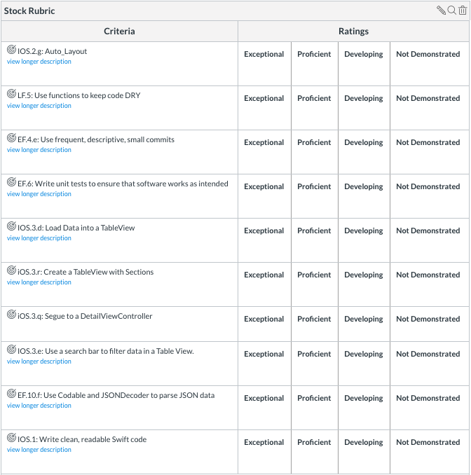

## Unit 3 Assignment 1 (People and Stock Prices)
Parsing JSON using Codable to create a tab bar controller consisting of Users and Apple Stock Prices

## Github Instructions
- Fork this repository.
- Clone it to your machine
- Complete the sections below
- Add, commit and push your changes
- Create a pull request from your fork back to the original repo here
- Paste the link to your fork into Canvas

## Gifs

Contacts TableView

Contacts Detail View Controller

Stocks TableView

Stock Detail View Controller

## Summary

You are given two .json files.  Create a Tab Bar Controller that manages two View Controllers, each one with a Table View inside.  Selecting a row in a table view should segue to another View Controller with more information about the specific item selected.  You must also use include Unit Tests for your models.

## JSON

JSON from the following projects is included in the project.

1. [Random UK users](https://randomuser.me/documentation)
2. [2 Years of APPL stock information](https://api.iextrading.com/1.0/stock/aapl/chart/2y)

# Part One: Contacts List

## Model

Create a class to hold the information from userinfo.json.

#### Use Codable

Use JSONDecoder().decode(<Decodable.protocol>, from: <Data>) to convert the JSON with **Codable**

## View Controller

Your View Controller should contain:

- A table view
- A search bar

The table view should list each contact in alphabetical order.  Each table view cell should contain the capitalized name of the contact and their location.  Feel free to use a default TableViewCell (e.g you don't need to create you own subclass).

The search bar should filter all the contacts based on their full name.

## Detail View Controller

Your detail View Controller should contain:

- A UIImage with the default profile image
- At least three labels to hold more information from the contact

You will need to use Auto Layout to constrain your views.  Feel free to customize this page with additional information.

# Part Two: APPL Stock Prices

## Model

Create a class to hold the information from applstockinfo.json.

#### Parse JSON

Use JSONDecoder().decode(<Decodable.protocol>, from: <Data>) to convert the JSON with **Codable**

## View Controller

Your View Controller should contain:

- A table view

The table view should list each stock price in order from oldest to newest.  Each table view cell should contain the date and the opening stock price.  Feel free to use a default TableViewCell (e.g you don't need to create you own subclass).

The table view should also have sections.  Every month and year should have its own section.  The title for the section should display the month and year as well as the average for all stock opening prices that month.

## Detail View Controller

Your detail View Controller should contain:

- A UIImage
- A label to represent the date
- Two labels to represent the opening and closing prices

If the stock price went up that day, set the background color to green and make the image a thumbs up.

If the stock price went down that day, set the background color to red and make the image a thumbs down.

You will need to use Auto Layout to constrain your views.

# Rubric

